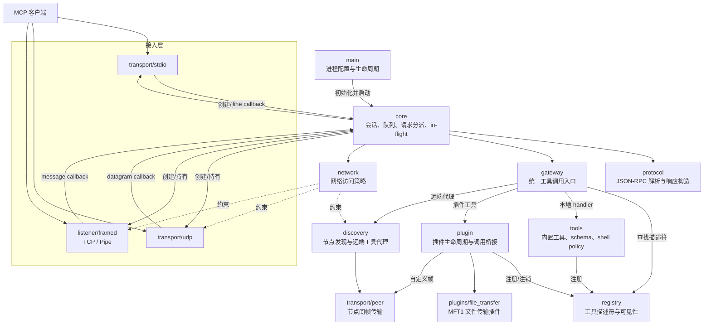
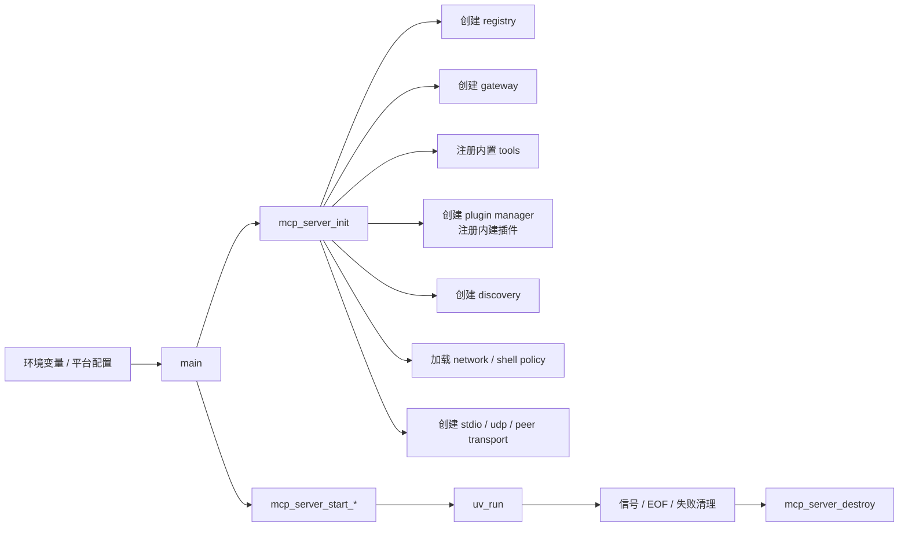
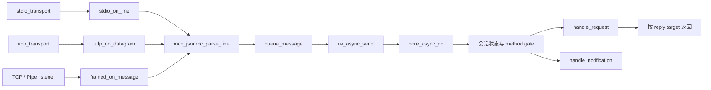
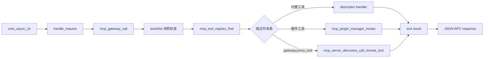
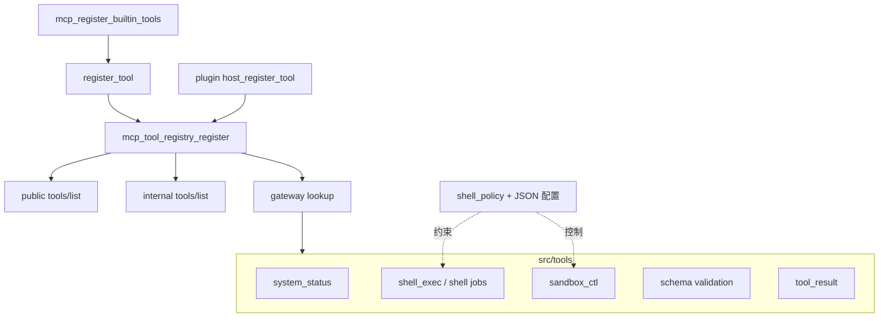
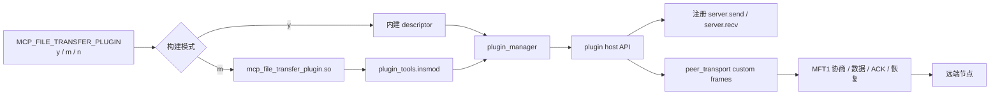
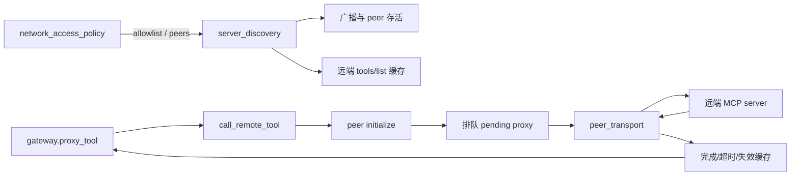
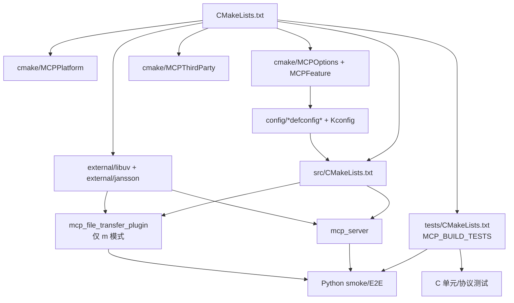

# MCP Server 模块结构拓扑

本文记录 `mcp_server` 当前源码的模块边界、核心调用链和构建关系。拓扑依据
CodeGraph 0.3.0 的项目本地索引生成，并用 `src/CMakeLists.txt`、公开头文件及关键
实现文件交叉核对。

## 索引快照

| 项目 | 数值 |
| --- | ---: |
| 索引日期 | 2026-09-21 |
| 数据库 | `.codegraph/codegraph.db` |
| 文件 | 71 |
| 节点 | 3,491 |
| 边 | 4,893 |
| 未解析引用 | 0 |

语言分布以符号数计：C 92.7%、Python 7.2%、Bash 0.1%。索引命令实际扫描
73 个文件，CodeGraph 数据库最终记录 71 个可解析文件。

## 总体拓扑



## 模块清单

| 模块 | 责任 | 关键文件 | CodeGraph 快照 |
| --- | --- | --- | ---: |
| `src/main` | 读取环境、选择接入方式、信号与事件循环生命周期 | `main.c` | 1 文件 / 39 符号 |
| `src/core` | 服务对象、会话门控、消息队列、请求/通知分派、取消跟踪 | `server.c`, `in_flight.c` | 4 文件 / 295 符号 |
| `src/protocol` | JSON-RPC 消息解析、结果和错误响应构造 | `jsonrpc.c` | 2 文件 / 20 符号 |
| `src/transport` | stdio、UDP 与节点间帧传输 | `stdio_transport.c`, `udp_transport.c`, `peer_transport.c` | 6 文件 / 358 符号 |
| `src/listener` | TCP/pipe framed listener 与连接生命周期 | `framed_listener.c` | 2 文件 / 96 符号 |
| `src/gateway` | 工具调用统一入口，本地、插件、远端三路分派 | `gateway.c` | 1 文件 / 23 符号 |
| `src/registry` | 工具注册、启停、查询和 public/internal 列表 | `tool_registry.c` | 1 文件 / 40 符号 |
| `src/tools` | 内置工具、schema、结果封装、shell 策略与任务 | `builtin_tools.c`, `shell_exec.c`, `shell_policy.c` | 11 文件 / 728 符号 |
| `src/plugin` | 内建/动态插件管理、host API、异步调用收口 | `plugin_manager.c` | 2 文件 / 195 符号 |
| `src/plugins/file_transfer` | MFT1 协议、断点续传、协商、发送队列 | `file_transfer_plugin.c` | 3 文件 / 631 符号 |
| `src/discovery` | 服务发现、peer 状态、工具缓存与代理调用 | `server_discovery.c` | 2 文件 / 398 符号 |
| `src/network` | allowlist、发现 peer 与网络访问配置校验 | `network_access_policy.c` | 2 文件 / 70 符号 |
| `src/common` | 平台兼容和饱和计数辅助 | `platform.h`, `json_counter.h` | 2 文件 / 7 符号 |
| `include/mcp` | 对外 server、gateway、registry、tool 与插件 ABI | `include/mcp/**` | 6 个接口目录 |
| `tests` | C 单元/协议测试和 Python 端到端 smoke tests | `tests/*` | 25 文件 / 504 符号 |

## 模块讲解与阅读入口

下面按“它解决什么问题、从哪里进入、把结果交给谁”的顺序解释各模块。若只想理解
一条 MCP 请求如何运行，可先阅读 `main -> core -> protocol -> gateway -> registry/tools`
这条主线，再按需阅读插件、发现和网络分支。

### `src/main`：进程装配层

- **解决的问题**：把环境配置转换成一个可运行的 MCP 服务进程，并负责启动、事件
  循环和退出清理；这里不实现具体协议或工具业务。
- **关键入口**：`main()` 读取 `MCP_ENABLE_STDIO`、`MCP_ENABLE_UDP`、
  `MCP_ENABLE_PIPE`、`MCP_ENABLE_TCP`、`MCP_ENABLE_DISCOVERY` 等环境变量，调用
  `mcp_server_init()`，再启动被启用的接入方式。
- **生命周期**：安装 SIGINT/SIGTERM 等退出信号后进入 `uv_run()`；退出时由 core
  统一关闭异步句柄、监听器和业务对象。
- **阅读建议**：要确认某种接入方式是否会在当前配置下启动，先看本模块；要理解该
  接入收到消息后如何处理，转到 `src/core`。

### `src/core`：服务编排与会话状态中心

- **解决的问题**：把 transport、listener、registry、gateway、plugin、discovery 和
  policy 组合成一个 `mcp_server`，是各模块共享状态的所有者。
- **关键状态**：`mcp_server` 保存消息队列、client session、tool snapshot、in-flight
  请求表以及所有子模块对象；会话按“未初始化 -> 等待 initialized 通知 -> 已初始化”
  推进。
- **请求处理**：各接入回调只负责解析并排队，`core_async_cb` 在 libuv 事件循环中统一
  调用 `handle_request()` 或 `handle_notification()`，因此业务分派不会直接发生在底层
  I/O 回调里。
- **异步请求**：`in_flight.c` 用 JSON-RPC id、invocation id、回复目标和定时器追踪
  尚未完成的调用，使插件或远端代理能够稍后回写，也支持取消与超时清理。
- **模块边界**：core 决定“何时处理、回给哪个连接”；具体工具由 gateway 分派，具体
  字节收发由 transport/listener 完成。

### `src/protocol`：JSON-RPC 编解码层

- **解决的问题**：把输入文本转换为统一的 `mcp_jsonrpc_message`，并构造 JSON-RPC
  成功响应、错误响应和换行分隔的输出文本。
- **关键入口**：`mcp_jsonrpc_parse_line()`、`mcp_jsonrpc_build_response()`、
  `mcp_jsonrpc_build_error_with_data()` 和 `mcp_jsonrpc_dump_line()`。
- **模块边界**：它只理解 JSON-RPC 消息形态，不维护 MCP 会话，也不判断某个 tool
  是否可见或有权执行；这些规则由 core、gateway 和策略模块承担。

### `src/transport`：底层消息与节点帧传输

- **stdio transport**：从标准输入按行读取 JSON-RPC，并将响应排入标准输出写队列；
  适合单客户端、进程托管式 MCP 连接。
- **UDP transport**：以 datagram 为消息边界接收请求，同时保存发送目标；适合无连接
  请求，但是否允许来源地址仍由 network policy/core 判断。
- **peer transport**：维护服务节点之间的连接、帧发送队列、magic handler 和能力标记。
  discovery 使用它传递远端 JSON-RPC，插件也可注册自定义帧，例如文件传输的 `MFT1`。
- **模块边界**：transport 负责“字节如何到达”；它不解释 tools/call 的业务含义。

### `src/listener`：TCP 与 pipe 的多连接封帧层

- **解决的问题**：libuv 的 TCP/pipe 是字节流，没有天然消息边界；本模块为每条消息
  增加 4 字节大端长度前缀，并为每个客户端保存接收缓冲和连接生命周期。
- **关键入口**：`mcp_framed_listener_start_tcp()`、
  `mcp_framed_listener_start_pipe()` 和 `mcp_framed_connection_send()`。
- **安全边界**：接收端拒绝长度为 0 或超过 `max_frame_bytes` 的帧；TCP 接受连接前还会
  调用 core 提供的地址准入回调。
- **与 transport 的区别**：listener 专门解决“一个监听端口上的多条流式连接和分帧”；
  stdio/UDP/peer 的收发实现仍归 `src/transport`。

### `src/gateway`：工具调用控制面

- **解决的问题**：为 core 提供唯一的工具调用入口 `mcp_gateway_call()`，统一执行会话
  可见性检查、descriptor 查询和路由选择。
- **分派规则**：`LOCAL_BUILTIN` 直接调用 descriptor handler；`LOCAL_MODULE` 转给
  plugin manager；`gateway.proxy_tool` 转给 discovery。声明但尚未实现的 route 会返回
  明确错误，而不会静默降级。
- **会话快照**：调用的工具必须存在于该 session 最近一次 `tools/list` 保存的快照中。
  注册表动态变化后，客户端需要重新调用 `tools/list` 才能调用新增工具。
- **观测信息**：gateway 维护总调用、本地调用、远端调用和拒绝调用计数，供状态工具读取。

### `src/registry`：工具目录与版本源

- **解决的问题**：拥有 `mcp_tool_descriptor` 的副本，提供注册、注销、启停、按名称查找
  以及 public/internal 两种列表视图。
- **descriptor 内容**：除名称、描述和 input schema 外，还记录来源、风险等级、权限、
  幂等/重试/取消能力、超时和 route；gateway 依赖这些元数据执行分派。
- **版本语义**：注册、注销或 enabled 状态发生变化时递增 `registryVersion`，便于调用方
  识别工具目录已经变化。
- **模块边界**：registry 回答“有哪些工具和元数据”；它不执行工具，也不负责会话快照。

### `src/tools`：内置工具及其执行策略

- **工具集合**：按构建特性注册 system、shell job、gateway、server、registry、plugin
  和 embedded 相关工具；`builtin_tools.c` 是名称到 handler 的集中装配入口。
- **schema 与结果**：`schema.c` 构造输入 JSON Schema；`tool_result.c` 把文本或 JSON
  统一包装成 MCP tool result，避免每个 handler 重复拼装协议结构。
- **shell 子系统**：`shell_policy.c` 从硬编码安全默认值、环境或 JSON 配置生成策略快照；
  `shell_exec.c` 执行同步命令或维护异步 job，并由 sandbox control 提供进程内策略覆盖。
- **模块边界**：工具 handler 实现业务，但注册和可见性属于 registry，调用路由属于
  gateway，JSON-RPC 响应仍由 core/protocol 构造。

### `src/plugin`：插件生命周期与 ABI 适配层

- **解决的问题**：让内建插件和动态库插件使用同一套 host API 注册工具、完成异步调用、
  发送 peer 帧并订阅 peer 事件。
- **加载路径**：内建插件通过 `mcp_plugin_manager_register_builtin()` 注册；动态插件由
  `plugin_tools.insmod` 经 `uv_dlopen()` 加载 ABI 符号，`rmmod` 执行 shutdown、注销工具
  并释放模块。
- **异步收口**：当插件返回 `MCP_PLUGIN_CALL_PENDING` 时，manager 保存 invocation 与原始
  JSON-RPC 请求的对应关系，插件之后通过 host API 完成成功或错误响应。
- **边界与约束**：`plugin_abi.h` 是主程序与插件之间的稳定契约；具体插件协议和文件操作
  不应放入 manager。

### `src/plugins/file_transfer`：MFT1 文件传输实现

- **解决的问题**：在 peer transport 上提供 `server.send`/`server.recv`，支持文件清单
  协商、分块传输、ACK、超时、写队列背压和断点续传。
- **协议关系**：插件用 `MFT1` magic 注册自定义帧处理器，并通过 peer capability 协商
  `mft.v1.resume`、`mft.v1.block_ack` 等能力；它不是普通 JSON-RPC 数据面的直接扩展。
- **异步行为**：目录准备和文件 I/O 可进入 libuv work queue，调用通常以 pending 状态
  返回，最终由 plugin host API 完成原始 tools/call。
- **构建与运行区别**：`y` 模式随服务内建，`m` 模式只生成动态库，仍需运行时 insmod；
  `n` 模式不构建该插件。

### `src/discovery`：节点发现与远端工具代理

- **解决的问题**：发现其他 MCP server、跟踪 peer 在线状态、缓存远端 tools/list，
  并把 gateway 的代理调用转换成节点间 JSON-RPC。
- **远端调用流程**：保证 peer 已建立并完成 initialize，创建 pending proxy，发送请求，
  然后在收到响应、超时或连接关闭时完成本地 in-flight 调用。
- **缓存语义**：peer 身份、连接状态或远端 registry 变化时，工具缓存需要刷新或失效；
  因此远端工具是否可用是运行态状态，不应仅由静态配置推断。
- **模块边界**：discovery 决定“找哪个节点并代理”；实际连接和帧队列由 peer transport
  提供，允许连接哪些地址由 network policy 决定。

### `src/network`：网络准入策略

- **解决的问题**：集中解析网络开关、IP allowlist 和预配置 discovery peers，避免 TCP、
  UDP 和 discovery 各自实现不一致的准入逻辑。
- **关键入口**：`mcp_network_access_policy_create_from_environment()`、
  `mcp_network_access_policy_allows_sockaddr()` 以及 peer 枚举接口。
- **失败策略**：配置解析与地址校验集中在策略对象中；调用模块只消费布尔判定或规范化的
  peer 条目，不自行放宽规则。

### `src/common`：跨模块基础辅助

- **`platform.h`**：封装 Windows/POSIX 差异，例如字符串复制、UTC 时间格式化和毫秒
  时间戳，避免业务文件散布条件编译。
- **`json_counter.h`**：提供饱和递增计数，限制在 JSON 有符号 64 位整数可表示范围内，
  用于 gateway/registry 等长期运行计数器。
- **模块边界**：这里只放无业务状态、可内联复用的小型能力；生命周期和协议逻辑不应
  下沉到 common。

### `include/mcp`：公共接口与跨边界契约

- **服务接口**：`core/server.h` 暴露初始化和各接入启动函数；调用者不需要看到
  `mcp_server` 的内部字段。
- **工具接口**：`tools/tool.h` 定义 descriptor、invocation 和 route，是 registry、gateway
  与 handler 之间的数据契约。
- **扩展接口**：`plugin/plugin_abi.h` 定义插件 ABI 1.1；`embedded/mep.h` 定义嵌入式端点
  的帧头、命令和状态码；二者都是跨编译单元或跨进程边界，修改时需考虑兼容性。
- **阅读建议**：新增能力前先判断它是否需要成为公共契约；纯内部实现优先留在 `src/**`
  的私有头文件中。

### `tests`：模块契约与跨模块行为验证

- **C 测试**：覆盖 JSON 计数、network/shell policy，以及文件传输的 offset、协商、协议
  边界、恢复、deadline 和写队列等细粒度契约。
- **Python smoke/E2E**：启动真实 server 进程，覆盖 stdio、UDP、TCP framed、无 stdio、
  discovery、动态插件、shell job、sandbox 和启动失败清理等跨模块路径。
- **定位方式**：修改纯函数或协议边界时优先找对应 C 测试；修改启动方式、连接生命周期
  或工具可见性时优先找相应 smoke 测试。本文只记录其拓扑，并未在本次文档更新中执行它们。

## 1. 启动与核心生命周期

`main()` 是进程入口。它根据环境配置初始化服务，按需启动 stdio、UDP、TCP、
pipe 和 discovery，进入 libuv 事件循环，最后按相反方向关闭资源。



CodeGraph 对 `main` 的调用图确认它直接调用 `mcp_server_init`、四个
`mcp_server_start_*` 入口和 `mcp_server_start_discovery`；对
`mcp_server_init` 的调用图确认初始化阶段创建 registry、gateway、plugin manager、
discovery、三类 transport、in-flight 表及 shell/network policy。

## 2. 接入、协议与核心消息队列

三种接入形态最终都在 core 中解析为 JSON-RPC。stdio 使用逐行消息，UDP 使用单个
datagram，TCP/pipe 使用 framed message；解析后的消息进入 core 队列，由 libuv
async 回调串行处理。



CodeGraph 的 caller 查询显示 `mcp_jsonrpc_parse_line` 的三个生产调用者正是
`stdio_on_line`、`udp_on_datagram` 和 `framed_on_message`。

## 3. 工具注册与调用分派

所有 `tools/call` 都经过 gateway。registry 只管理工具元数据和 handler；gateway
负责会话快照可见性检查及实际路由。



CodeGraph 显示 `mcp_gateway_call` 的直接调用者是 `handle_request`，上游为
`core_async_cb`；其下游同时包含插件调用和远端代理调用。

## 4. 内置工具、注册表与策略



`mcp_tool_registry_register` 的 CodeGraph caller 包含内置工具的 `register_tool`、
插件 host API 的 `host_register_tool` 和 file-transfer 插件的注册路径。

## 5. 插件与文件传输

插件管理器同时支持编入主程序的插件和运行时动态模块。file-transfer 可以按构建配置
设为 `y`（内建）、`m`（动态模块）或 `n`（不构建）。



动态模块被构建并不表示运行中的服务已经加载它；`m` 模式必须显式 insmod 后，工具
才会出现在运行态列表中。

## 6. 服务发现、远端代理与网络策略



CodeGraph 的 callee 查询显示远端调用路径会初始化 peer、发送待处理代理请求、维护
超时并在状态变化时使工具缓存失效。网络策略模块负责严格解析 allowlist 和 discovery
peer 配置。

## 7. 构建与测试拓扑



## 维护方式与证据边界

源码结构变化后，从仓库根目录更新索引：

```bash
codegraph index .
```

验证 MCP 使用当前项目数据库时，应显式指定绝对路径，然后依次调用
`initialize`、`tools/list`、`codegraph_stats` 和项目符号查询：

```bash
codegraph serve --db /home/xwk/workspace/mcp_server/mcp_server/.codegraph/codegraph.db
```

本文是静态源码与构建清单拓扑，不代表各编译开关组合都已构建，也不证明网络、插件或
硬件环境中的运行行为。CodeGraph 自动生成的原始 module diagram 是文件级图；本文将
其跨文件关系压缩为模块级关系，避免把测试辅助函数或同名符号误当成生产主链。
